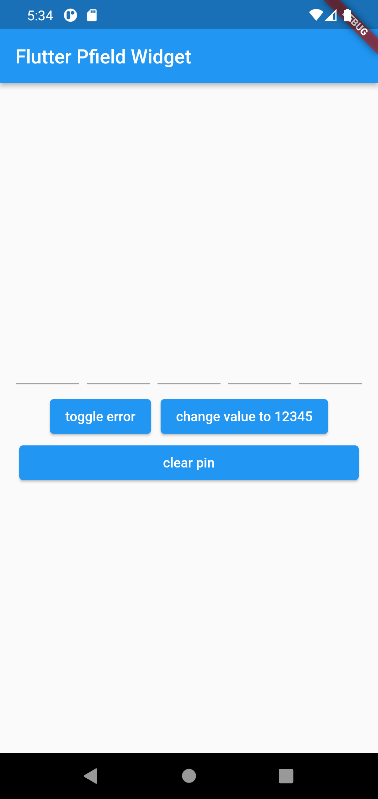
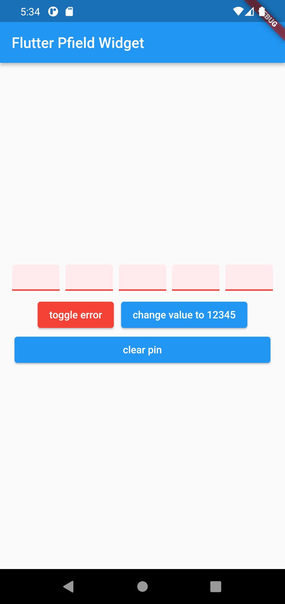

[PFIELD]('https://github.com/micodev/pfield') a flutter widget that offer pin code textfield with best mechanism, it also can be used responsivly with any platform, feel free to open a pull request or create new feature request I'll be very happy to update it with your creative idea.

> ⭐️ Thanks **everyone** who has starred the project, it means a lot!

## Features

- responsive.
- easy to use.
- made with love using dart ❤️.

## Getting started

Just add it to your `pubspec.yaml` or use
command line below:
`flutter pub add pfield`

## Usage

You can run the example the example folder to explore the features and use cases also.

```dart
Pfield(); // all parameters are optional.
```

## Additional information

Feel free to open a pull request or create new feature request I'll be very happy to update it with your creative idea.

Also you can get in touch with me for further help.

- [Ibrahim](https://t.me/anime19)

## Screen Shots



